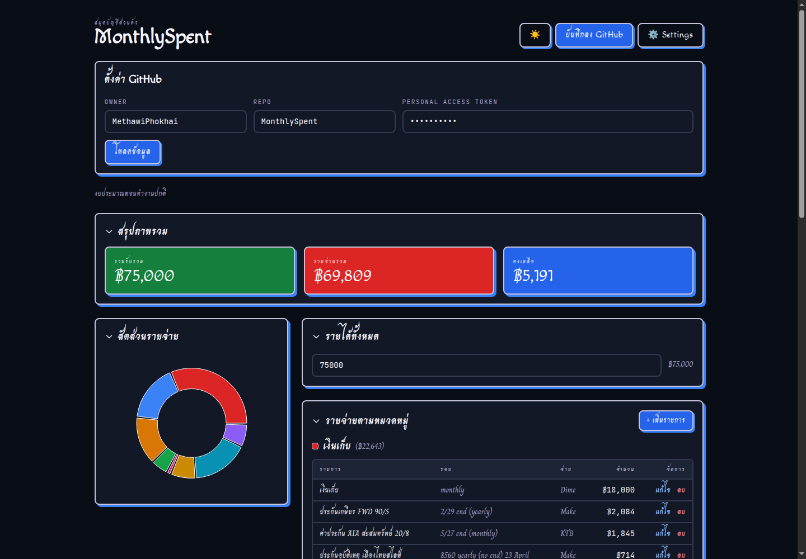
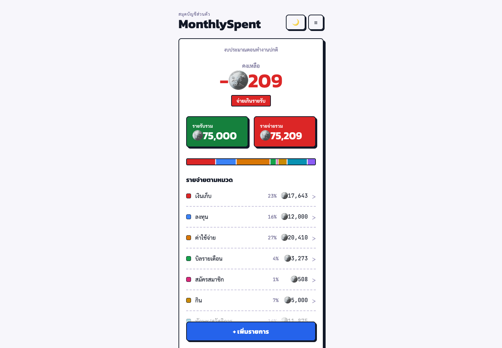
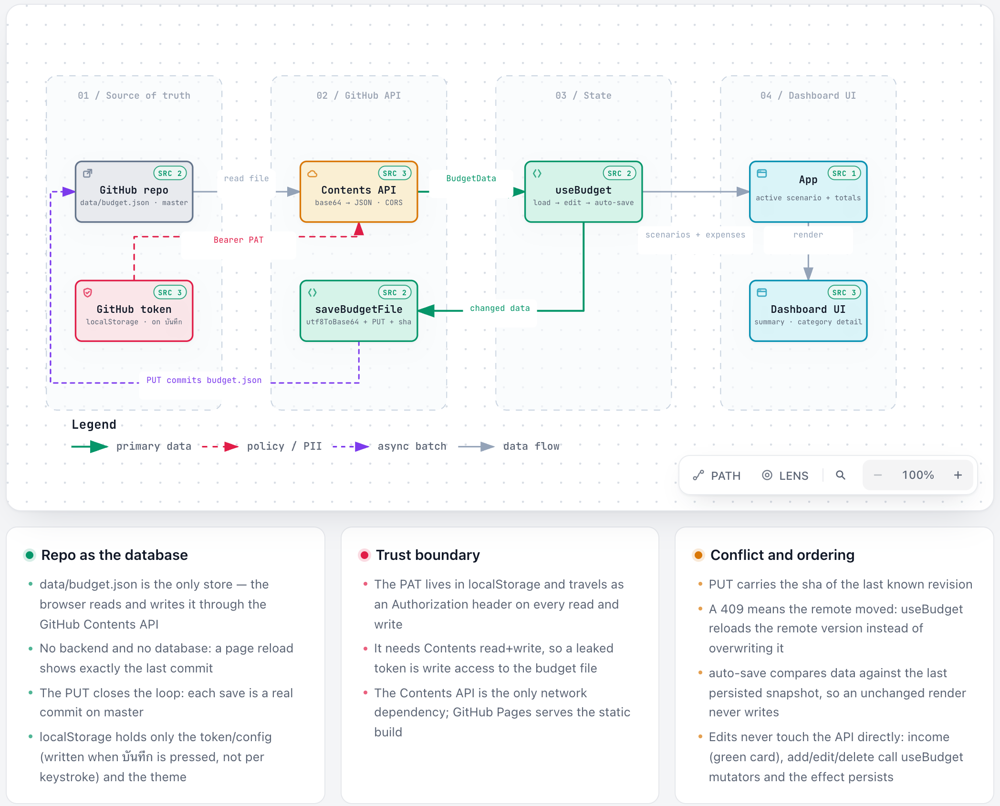

# MonthlySpent

เว็บส่วนตัวสำหรับบันทึกรายรับรายจ่ายรายเดือน (สถานการณ์ "มีรายได้") แก้ไขเพิ่มลบรายการผ่านหน้าเว็บ เก็บข้อมูลเป็น JSON file ใน git repo และ deploy บน GitHub Pages

## Tech Stack

- React 18 + TypeScript
- Vite
- Tailwind CSS
- GitHub REST API (client-side)

## การตั้งค่า

1. Fork หรือ clone repo นี้
2. สร้าง GitHub Personal Access Token (fine-grained) ที่มีสิทธิ์ **Contents: read and write** สำหรับ repo นี้
3. เปิดเว็บ กดเมนู ☰ มุมขวาบน → "ตั้งค่า GitHub" กรอก Owner, Repo, Token แล้วกด "บันทึก" — ระหว่างพิมพ์จะยังไม่โหลดอะไร พอกดบันทึกจึงเก็บค่าและโหลดข้อมูลครั้งเดียว (สำเร็จแล้วแผงตั้งค่าจะพับเก็บเอง ถ้าล้มเหลวจะค้างไว้พร้อมข้อความ error)
4. เริ่มแก้ไขรายรับรายจ่ายได้เลย

## Features

layout เป็นคอลัมน์เดียวขนาดมือถือ (ทุกขนาดจอ) ตามดีไซน์ "Monthly Spent v3 Simple" ใน Claude Design แต่ใช้ธีม retro ของ repo นี้ — มี 2 หน้า

**หน้าสรุป**
- ยอดคงเหลือตัวใหญ่ พร้อมป้าย "อยู่ในงบ" หรือ "จ่ายเกินรายรับ" (สีแดง) เมื่อรายจ่ายเกินรายรับ
- การ์ดรายรับรวม / รายจ่ายรวม — แตะตัวเลขในการ์ดรายรับรวม (สีเขียว) เพื่อแก้ไข กด Enter หรือแตะที่อื่นเพื่อบันทึก, Esc เพื่อยกเลิก
- แถบสัดส่วนรายจ่ายตามหมวด + รายการหมวดพร้อม % และยอดรวม — แตะหมวดเพื่อเข้าหน้ารายละเอียด
- ปุ่ม "+ เพิ่มรายการ" ติดอยู่ด้านล่างเสมอ
- แถบสลับสถานการณ์แสดงเฉพาะเมื่อมีมากกว่า 1 scenario ใน JSON

**หน้ารายละเอียดหมวด**
- ยอดรวมของหมวด และ % ของรายจ่ายทั้งเดือน
- รายการในหมวด พร้อมรอบจ่ายและวิธีจ่าย ปุ่ม "แก้" / "ลบ" ต่อรายการ
- ปุ่ม "+ เพิ่มรายการในหมวดนี้" เปิดฟอร์มโดยเลือกหมวดไว้ให้แล้ว · ปุ่ม "<" กลับหน้าสรุป

**ทั่วไป**
- ธีมมืด (dark mode) เป็นค่าเริ่มต้น + ปุ่มสลับเป็นธีมสว่างที่จำค่าไว้ใน browser
- บันทึกขึ้น GitHub อัตโนมัติทุกครั้งที่แก้ไข (หรือกด ☰ → "บันทึกลง GitHub" เองก็ได้)
- เมนูแฮมเบอร์เกอร์ ☰ มุมขวาบนรวม "บันทึกลง GitHub" และ "ตั้งค่า GitHub" (ปิดเองเมื่อเลือก, คลิกนอกเมนู หรือกด Esc)

## Theme (retro)

ธีมทั้งแอปมาจาก**ไฟล์เดียว**: [`src/styles/theme.css`](src/styles/theme.css) — design system สไตล์ retro แบบ letterpress (สีทึบเต็ม, เส้นขอบหมึก 2px, เงาแข็ง) ตาม skill [retro](https://www.typeui.sh/design-skills/retro)

หลักการเดียว: component ถือแค่ **semantic class** (`.card`, `.btn`, `.stat`, `.screen`, `.list-row`, `.kicker` …) ห้ามใส่ utility สี/ฟอนต์/มุมโค้งลงใน component — [`src/__tests__/theme.test.ts`](src/__tests__/theme.test.ts) จะ fail ถ้ามีหลุดเข้าไป

| อยากแก้อะไร | แก้ที่ไหน |
|---|---|
| สี / ฟอนต์ / เงา / โหมดมืด | token ใน `:root` + `.dark` |
| หน้าตา component เช่น `.btn` ทุกปุ่ม | rule ใน `@layer components` |
| เพิ่ม variant ใหม่ | เพิ่ม modifier class ที่ theme.css ไม่ใช่ใน markup |

โทเคนสำคัญ

- `--primary #3B82F6` · `--secondary #8B5CF6` · `--line` เส้นหมึก · `--ink` / `--ink-soft` / `--ink-muted` ลำดับตัวอักษร
- `--fill-*` พื้นสีทึบที่มีตัวหนังสือขาว และ `--link-*` สีตัวอักษรที่กลับด้านในโหมดมืด — เลือกเฉดให้ผ่าน WCAG AA (4.5:1) แล้ว (ตรวจกับหน้าที่ build จริงได้ 0 จุดที่ตก)

ฟอนต์: **Kanit** (display — มีทั้งไทยและ Latin) + **Sarabun** (เนื้อหาไทย อ่านง่ายที่สุด) + **JetBrains Mono** (label/ตัวเลข) — ทุก stack ต้องมีฟอนต์ไทยจริงอยู่ท้าย ไม่งั้นตัวไทยจะไปตกที่ fallback ซึ่งอ่านยาก

โหมดมืดเป็นค่าเริ่มต้น (`<html class="dark">` ใน `index.html` กันจอวาบ)




## Code Graph (graphify)

repo นี้มี **knowledge graph ของโค้ดตัวเอง** อยู่ที่ [`graphify-out/`](graphify-out/) — ใช้เป็นจุดเริ่มต้นก่อนอ่านโค้ด จะเร็วกว่าและประหยัด token กว่าไล่อ่านทุกไฟล์

| ไฟล์ | ใช้ทำอะไร |
|---|---|
| [`graphify-out/wiki/index.md`](graphify-out/wiki/index.md) | **จุดเริ่มต้นสำหรับ AI** — สารบัญ community + god nodes |
| [`graphify-out/GRAPH_REPORT.md`](graphify-out/GRAPH_REPORT.md) | god nodes, ความเชื่อมโยงน่าสนใจ, import cycles, คำถามที่กราฟตอบได้ |
| [`graphify-out/graph.json`](graphify-out/graph.json) | กราฟเต็ม (123 nodes / 283 edges) สำหรับ `query` / `path` / `explain` |
| [graph.html](https://methawiphokhai.github.io/MonthlySpent/graph.html) | กราฟแบบ interactive เปิดในเบราว์เซอร์ |

### โครงสร้างโค้ดตามกราฟ (10 communities)

> กราฟใน `graphify-out/` ยังเป็นของก่อน redesign v3 — รัน `npm run graph` เพื่อสร้างใหม่ (ตารางด้านล่างอัปเดตด้วยมือแล้ว)

| Community | ไฟล์หลัก | หน้าที่ |
|---|---|---|
| App shell + ธีม (29) | `App.tsx`, `HeaderMenu`, `ItemModal`, `ThemeToggle`, `constants.ts` | ประกอบหน้า (สรุป ↔ รายละเอียดหมวด), modal, สลับธีม |
| Category screens | `components/CategoryBreakdown.tsx`, `components/CategoryDetail.tsx` | แถบสัดส่วน + รายการหมวด และหน้ารายการในหมวด (แทน `BudgetTable`, `DonutChart`, `Collapsible` เดิม) |
| useBudget state machine (14) | `hooks/useBudget.ts` | load → edit → auto-save |
| Summary & formatting (12) | `SummaryCards.tsx`, `utils/format.ts` | การ์ดสรุปยอด (แก้รายรับได้ในการ์ด) + จัดรูปเงิน/class |
| GitHub API client (10) | `api/github.ts` | GitHub Contents API (fetch/save `data/budget.json`) |
| Scenario tabs & types (10) | `types/budget.ts`, `components/ScenarioTabs.tsx` | type ของ domain |
| Settings panel (7) | `components/SettingsPanel.tsx` | owner/repo/token + สถานะ sync |

**God nodes** (concept ที่ทุกอย่างวิ่งผ่าน) — `App()` 19 · `ExpenseItem` 18 · `Category` 13 · `formatCurrency()` 10 · `PaymentMethod` 9 · `BudgetData` 8 · `useBudget()` 8 · `GitHubConfig` 7
**Import cycles:** ไม่มี

### คำสั่งที่ใช้บ่อย

```bash
npm run graph          # สร้างกราฟใหม่ทั้งรอบ (AST ล้วน ไม่ใช้ LLM ไม่มีค่าใช้จ่าย)
npm run graph:update   # อัปเดตหลังแก้โค้ด (เร็ว)
graphify query "how does budget data flow from GitHub to the UI"
graphify explain "useBudget"
graphify path "App()" "ExpenseItem"
```

### ประหยัด token แค่ไหน (วัดจริงใน repo นี้)

| วิธี | token |
|---|---|
| อ่าน `src/` ทั้งหมด (34 ไฟล์) | 18,134 |
| อ่าน `wiki/index.md` เพื่อทำความเข้าใจโครงสร้าง | **432** (42x น้อยกว่า) |
| อ่าน `GRAPH_REPORT.md` | **1,368** (13x น้อยกว่า) |
| `graphify query` 1 คำถาม | 1,402 – 5,781 |

ข้อจำกัดที่ต้องรู้: กราฟช่วยตอน **"หา"** ไม่ได้ช่วยตอน **"แก้"** — ไฟล์ที่จะแก้ยังต้องอ่านจริง · กราฟจะให้ข้อมูลผิดถ้าไม่รีเฟรช (รัน `npm run graph:update` หลังแก้โค้ด) · สถาปัตยกรรมที่เปลี่ยนจะไม่โผล่จนกว่าจะรันซ้ำ

## Data Flow (archify)

ไดอะแกรมการไหลของข้อมูลงบประมาณ — จากไฟล์ JSON บน GitHub เข้ามาใน UI แล้วเขียนกลับเป็น commit สร้างด้วย [archify](https://github.com/tt-a1i/archify) ประเภท `dataflow`



- เปิดดูแบบ interactive: [dataflow.html](https://methawiphokhai.github.io/MonthlySpent/dataflow.html)
- ต้นฉบับที่ใช้สร้าง (source of truth): [`docs/diagrams/budget-data-flow.dataflow.json`](docs/diagrams/budget-data-flow.dataflow.json)

### 4 stages

| Stage | Node | หน้าที่ |
|---|---|---|
| 01 Source of truth | `GitHub repo` · `GitHub token` | `data/budget.json` บน `master` + PAT ที่เก็บใน localStorage |
| 02 GitHub API | `Contents API` · `saveBudgetFile` | ครึ่งอ่าน (GET + base64) และครึ่งเขียน (PUT + sha) |
| 03 State | `useBudget` | load → edit → auto-save (state เดียว ไม่มี store) |
| 04 Dashboard UI | `App` · `Dashboard UI` | render จาก props เท่านั้น ไม่เขียนข้อมูลเอง |

**เส้นทางข้อมูล:** `read file` → `Bearer PAT` → `BudgetData` → `scenarios + expenses` → `render`
**เส้นทางเขียนกลับ:** `changed data` (auto-save) → `PUT commits budget.json`

### จุดที่ไดอะแกรมยืนยันจากโค้ด

- **ไม่มี backend และไม่มีฐานข้อมูล** — `data/budget.json` คือ store เดียว เบราว์เซอร์อ่าน/เขียนผ่าน GitHub Contents API ตรง ๆ (CORS) รีเฟรชหน้าแล้วได้สถานะของ commit ล่าสุดเสมอ
- **Trust boundary** — PAT อยู่ใน localStorage และถูกส่งเป็น Authorization header ทุกครั้ง ถ้า token หลุด = สิทธิ์เขียนไฟล์งบประมาณ
- **กันเขียนทับ** — PUT แนบ `sha` ของ revision ล่าสุด ถ้าได้ `409` ให้ `useBudget` โหลดเวอร์ชันจาก remote กลับมาแทน
- **ไม่เขียนมั่ว** — auto-save เทียบข้อมูลกับ snapshot ที่ persist ล่าสุด render ที่ข้อมูลไม่เปลี่ยนจะไม่ยิง write

### คำสั่งที่ใช้บ่อย

```bash
archify validate dataflow docs/diagrams/budget-data-flow.dataflow.json --quality showcase
archify render   dataflow docs/diagrams/budget-data-flow.dataflow.json   # เขียนทับ public/dataflow.html
```

`finalize` คือคำสั่งที่ใช้จริงตอนสร้างไฟล์นี้ — มันรัน validate + browser check + composition check ให้ในตัว ถ้าแก้ flow แล้วมีเส้นทับกันหรือ label ชน node มันจะบอกพิกัดที่ชนมาตรง ๆ

## Scripts

```bash
npm install
npm run dev        # รัน dev server
npm run build      # build สำหรับ production
npm run test       # รัน tests
npm run typecheck  # เช็ค TypeScript types
npm run graph      # สร้าง knowledge graph ของโค้ดใหม่
npm run diagram    # validate + render data flow diagram ใหม่
```

## Deploy

GitHub Actions workflow ใน `.github/workflows/deploy.yml` จะ test, build และ deploy อัตโนมัติเมื่อ push ไป `master`

## โครงสร้างโค้ด

```
src/
  api/github.ts           # GitHub Contents API client (fetch/save budget.json)
  hooks/useBudget.ts      # data lifecycle: load -> edit -> auto-save
  hooks/useLocalStorage.ts
  hooks/useTheme.ts       # theme state; keeps the `dark` class on <html> in sync
  styles/theme.css        # ทุกอย่างของธีมอยู่ที่นี่ (token + component class)
  components/             # presentational components (props เป็น readonly ทั้งหมด)
                          #   SummaryCards + CategoryBreakdown = หน้าสรุป, CategoryDetail = หน้าหมวด
  utils/                  # formatCurrency, getCategoryTotals
  types/budget.ts         # shared domain types
  constants.ts            # storage key, file path, default scenario
data/budget.json          # ข้อมูลหลัก อ่าน/เขียนผ่าน GitHub API
```

### Data lifecycle

ทุกการแก้ไขไหลตามลำดับนี้เสมอ:

```
event (user แก้ไข) -> setData -> render -> auto-save effect -> PUT ขึ้น GitHub
```

เพื่อให้ข้อมูลที่ส่งขึ้น server เป็นข้อมูลล่าสุดเสมอ ไม่มีการอ่าน state ระหว่าง render
(ดู comment แบ่ง lifecycle ไว้ใน `src/hooks/useBudget.ts`)

ดูภาพรวมทั้งเส้น (อ่าน + เขียนกลับ) ได้ที่ [Data Flow (archify)](#data-flow-archify) ด้านบน — [`docs/diagrams/budget-data-flow.dataflow.json`](docs/diagrams/budget-data-flow.dataflow.json)

ดูรายละเอียดเพิ่มเติมได้ใน [`docs/design-spec.md`](docs/design-spec.md)
